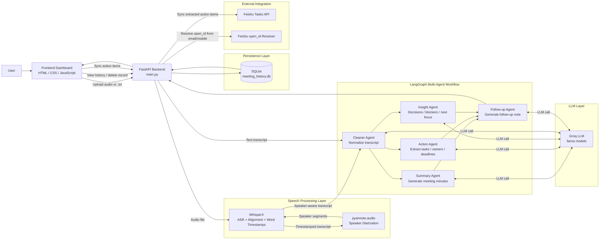

# AI Meeting Minutes Assistant - System Architecture Diagram

This diagram reflects the current implemented milestone version of the project.

## Mermaid Diagram

## Short Explanation

- The **frontend dashboard** handles upload, template selection, result display, history browsing, and Feishu sync actions.
- The **FastAPI backend** coordinates the full pipeline and exposes REST APIs.
- For audio input, **WhisperX** performs transcription and alignment, while **pyannote** adds speaker diarization.
- The processed transcript enters a **LangGraph multi-agent workflow**:
  - `Cleaner Agent`
  - `Summary Agent`
  - `Action Agent`
  - `Insight Agent`
  - `Follow-up Agent`
- The reasoning agents call the **Groq LLM layer** for transcript cleaning, summarization, extraction, and follow-up generation.
- Final meeting results are stored in **SQLite** and returned to the frontend.
- Extracted action items can optionally be synchronized to **Feishu Tasks**.

## PPT-Friendly One-Line Summary

The system combines a frontend dashboard, a FastAPI backend, a WhisperX + pyannote speech pipeline, a LangGraph multi-agent reasoning workflow, SQLite persistence, and optional Feishu task integration.
